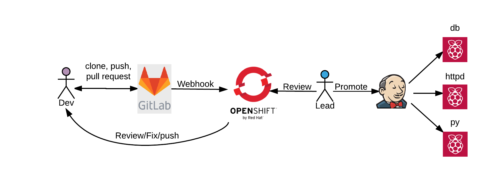
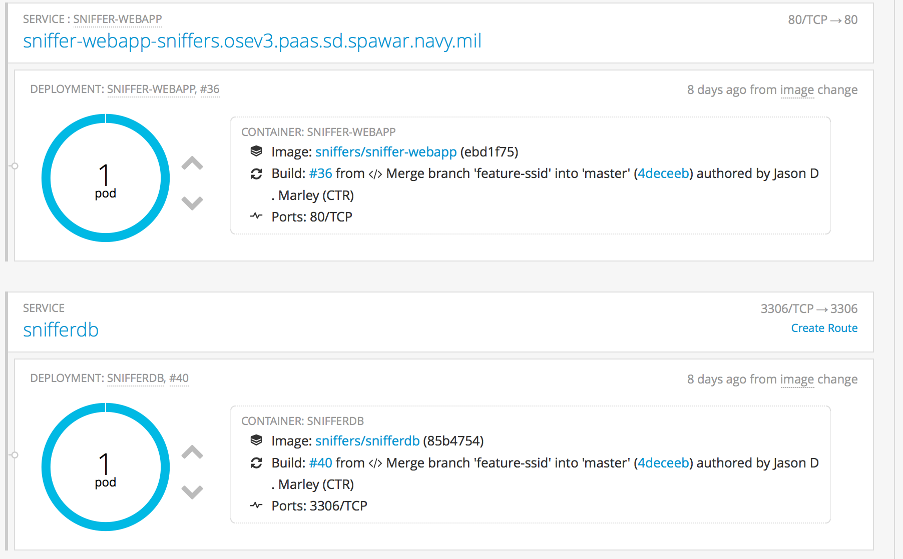

= Who's Home Stack
:source-highlighter: pygments
:icons: font

This project is the 3-tier application that demonstrates how to leverage a CI/CD
pipeline to use OpenShift(OSE) version 3 for development and push to Raspberry Pi as
the production server.

== Architecture
.Raspberry Pi CI/CD Workflow

== Development Environment Setup
This app allows users to register they're name with a known bluetooth and wifi
signal as well as allow users the ability to view the current bluetooth and wifi
MAC addresses in the radius of the discovery sensor.

.Create OpenShift project
. https://docs.openshift.com/enterprise/3.1/cli_reference/get_started_cli.html#installing-the-cli[Install OpenShift cli tooling]
. login
+
[source,bash]
----
$ oc login https://<server-name>:8443 -u <username> -p <passwd>
----

. Create project
+
[source,bash]
----
$ oc new-project <project-name>
----

.Setup Source Control
. Create feature branch (e.g. `feature-branch`) for feature development
+
[source,bash]
----
$ git checkout -b feature-branch
$ git push origin feature-branch
----

. Search and replace `git@github.com:jmarley/whos-home.git` with your own
repo <uri>
+
[source,bash]
----
$ grep -rl 'git@github.com:jmarley/whos-home.git' /path/to/dir/whos-home/ \
| xargs sed -i "" 's/git@github.com:jmarley\/whos-home.git/<uri>/g'
----

. Search and replace `feature-branch` with your own branch
repo <own-feature-branch>
+
[source,bash]
----
$ grep -rl 'feature-branch' /path/to/dir/whos-home/ \
| xargs sed -i "" 's/feature-branch/<own-feature-branch>/g'
----

.Setup Source Control Secrets
. Create ssh key pair
+
[source,bash]
----
ssh-keygen -t rsa -C "jmarley@redhat.com" -f ./keys/id_rsa_myprj
----
. Add private key as ose secret
+
[source,bash]
----
$ oc secrets new-sshauth <my-ssh-secret-name> \
--ssh-privatekey=</path/to/keys/id_rsa_myprj>
----
. Add deployer pub key to SCM
+
NOTE: Dependent on which SCM tool, please refer to tools documentation

. Update dev buildconfigs with secret
+
[source,bash]
----
$ grep -rl 'sshsecret' /path/to/dir/whos-home/ \
| xargs sed -i "" 's/sshsecret/<my-ssh-secret-name>/g'
----
. Create webhook

NOTE: This will depended on the SCM tool used,please refer to documentation

.Create Database
[source,bash]
----
$ oc create -f openshift/mysql/mysql-buildconfig-dev.yaml
$ oc deploy <db-app-name> --latest -n <project-name>
----

.Create Webapp
[source,bash]
----
$ oc create -f openshift/php-webapp/webapp-buildconfig-dev.yaml
$ oc deploy <php-app-name> --latest -n <project-name>
----

.Pods Successfully Deployed

== Troubleshooting

.Known Bugs
. report bug with oc tool, can't logout unless connected to the Server
. report issue with vagrant and .ssh/authorized params

.Local MySQL Database Container
. pull docker image
+
[source,bash]
----
$ docker build -t mysql -f support/docker/mysql/dev/Dockerfile .
----

. run docker image
+
[source,bash]
----
$ docker run -p 3306:3306 \
--name snifferdb \
-e MYSQL_USER=admin \
-e MYSQL_ROOT_PASSWORD=sniffered \
-e MYSQL_PASSWORD=pungent \
-d mysql
----

.Restore database schemas
. Restore Empty DB
+
[source,bash]
----
$ mysql --host=127.0.0.1 -u root -psniffered \
< database/snifferdb-schema.sql
----
. Restore DB with data
+
[source,bash]
----
mysql --host=127.0.0.1 -u root -psniffered \
< snifferdb-schema-with-data.sql
----

.Local Apache webserver Container
. Build Apache-php Docker
+
[source,bash]
----
$ docker build -t apache-php -f support/docker/apache-php/Dockerfile .
----

. Run Apache-php Docker Container
+
[source,bash]
----
$ docker run -d --name sniffer-webapp \
-e OPENSHIFT_MYSQL_DB_HOST \
-e OPENSHIFT_MYSQL_DB_PORT \
-e OPENSHIFT_MYSQL_DB_USERNAME \
-e OPENSHIFT_MYSQL_DB_PASSWORD \
-e OPENSHIFT_MYSQL_DBNAME \
apache-php
----

== References

. http://webcheatsheet.com/sql/mysql_backup_restore.php[MySql Backup and Restore]
. https://www.digitalocean.com/community/tutorials/how-to-install-mysql-on-ubuntu-14-04[MySql Server Configuration]
. https://www.digitalocean.com/community/tutorials/how-to-create-a-new-user-and-grant-permissions-in-mysql[Adding Users]
. https://hub.docker.com/_/php/[php docker container]
. https://docs.openshift.com/enterprise/3.2/dev_guide/builds.html#ssh-key-authentication[ose secrets]
